# 项目功能分解

## 用户模块
1. 注册 - 成为背单词用户
2. 登录 - 校验用户身份
3. 退出登录 - 退出登录状态
4. 注销用户 - 从数据库中删除用户
5. 修改密码

## 单词模块
1. 导入单词库 - 可以自己导入单词库，excel或者csv类型
2. 导入需要记忆的单词列表 - 可以导入别人制作的单词书，excel、csv、txt
3. 创建记忆单词列表
4. 将单词加入记忆单词列表
5. 将单词从记忆单词列表中删除
7. 导出单词记忆列表

## 记忆模块
1. 能够规划每天记忆的单词的数量。
2. 能够从上一天最后背的单词的下一个开始背。
3. 第一次记忆时，划分3个认识程度的标准：陌生、模糊、熟悉。其中，熟悉可以不用记忆，另外两个程度记忆的频率要有所区分。
4. 记忆时，先只显示单词，选择了3个认识程度之后，再显示全部的信息。
5. 记忆按照7（暂定）个1组来记忆，即第一轮，先认识7个，然后将其中的陌生的单词立刻再次记忆。然后，记忆下一组的单词时，把这一组的单词中的陌生和模糊放入下一组单词的陌生中，一起记忆。如果还是陌生，立刻放入到末尾继续记忆，如果是模糊，则继续放入下一组，如果是熟悉，则移出这一天的记忆。
6. 再次记忆时，需要完全拼写单词正确。
7. 选择需要记忆的单词本（列表）

## 数据展示模块
1. 显示记忆的单词数量。（条形图）
2. 记忆遗忘曲线。（折线图）
3. 显示背单词的进度。
4. 连续签到、累计签到、最大连续
5. 平均每天新学单词量、平均每天复习单词量（饼图）

## 特殊模块
1. 通过导入txt英文文本，识别里面的单词，然后爬取bing的单词库，制作属于自己的单词库和单词记忆列表。
2. 搜索单词

---
## 登录

## 注册
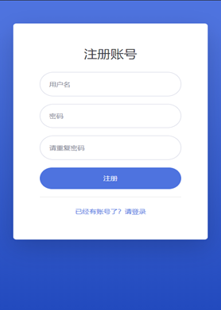

## 数据展示
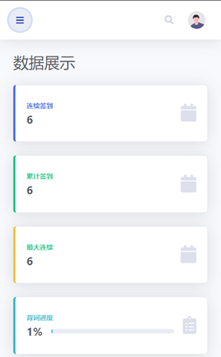
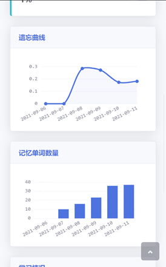
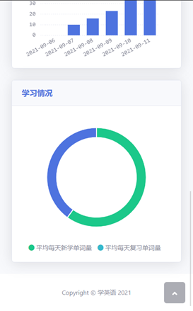
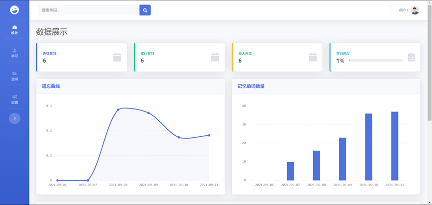
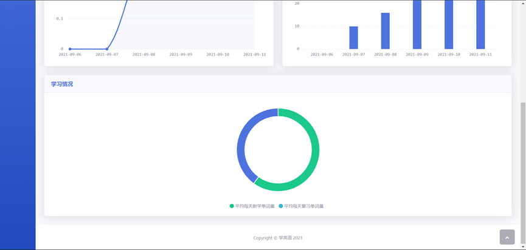
## 学习的页面
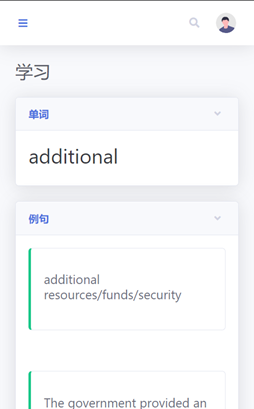
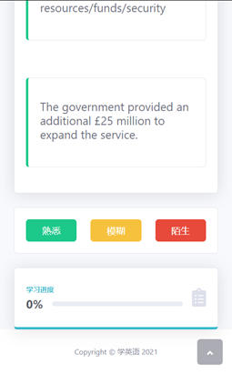
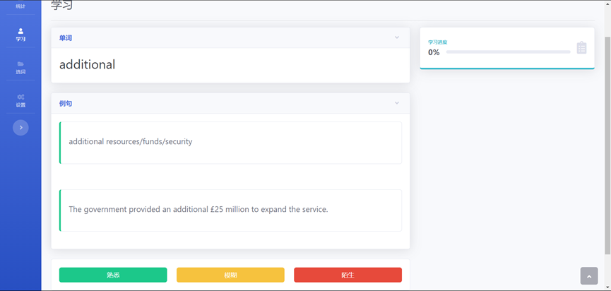
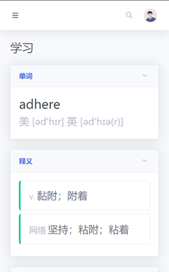
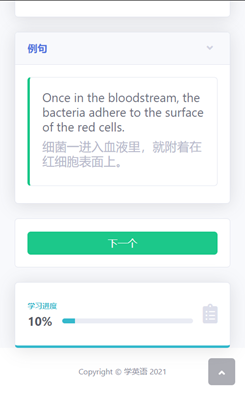
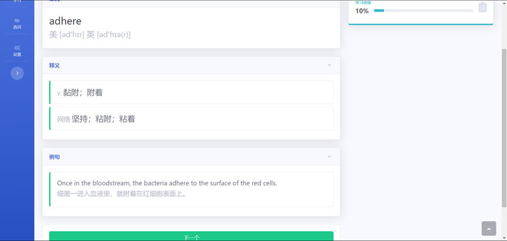
## 复习的页面
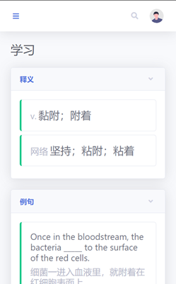
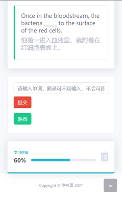
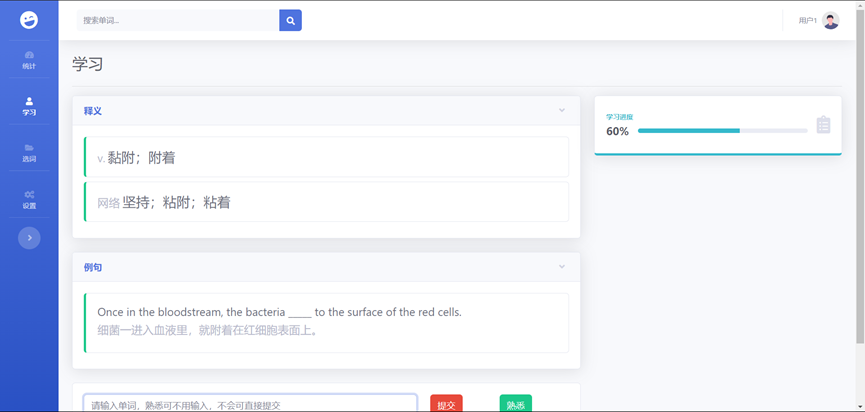

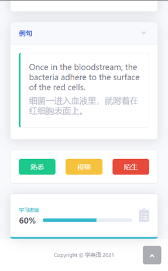
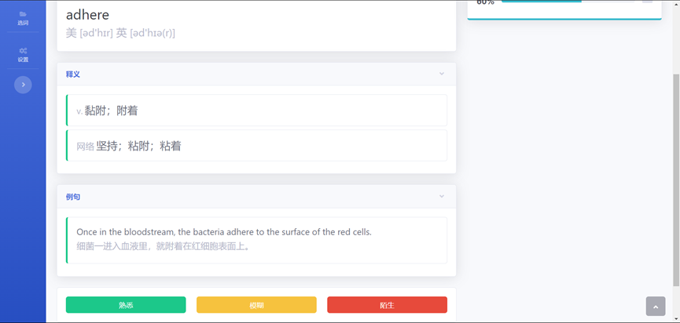
